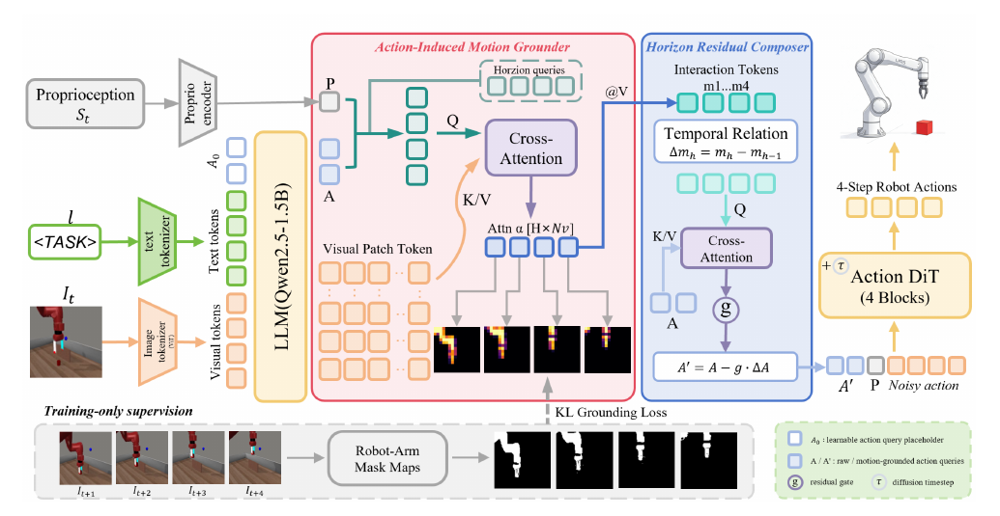
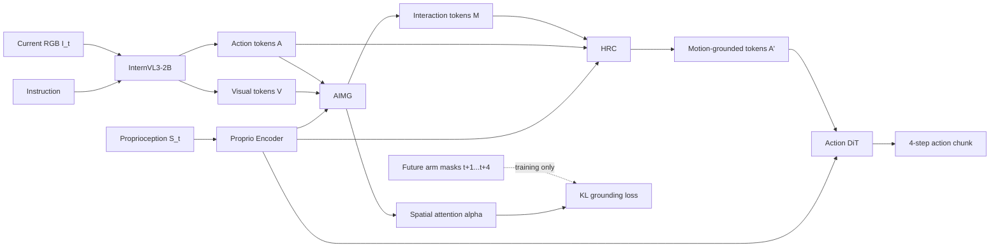

# MotionWeave

Official implementation of **MotionWeave: Learning Motion-Centered Future Dynamics for Vision-Language-Action Policies**.

MotionWeave avoids reconstructing the complete future. Instead, it learns the local visual changes that matter to each action timestep. The **Action-Induced Motion Grounder (AIMG)** produces horizon-specific interaction representations from current visual tokens, while the **Horizon Residual Composer (HRC)** injects their temporal differences into action tokens before Action DiT denoising. Future robot-arm masks supervise grounding only during training; inference uses the current RGB observation, language instruction, and proprioception.

<p align="center">
  
</p>

## Highlights

- Horizon-specific grounding: one AIMG query for each step in the action chunk.
- Motion-centric supervision: future robot-arm masks suppress static background and appearance.
- Temporal action refinement: HRC models adjacent-horizon differences with a gated residual.
- No future reconstruction at inference: the policy directly predicts a 4-step action chunk.
- 75.3% average success over six challenging MetaWorld tasks.

## Results

Success rate (%) over 25 episodes per task. All methods use the same evaluation seeds.

| Method | Pick Place | Disassemble | Stick Pull | Assembly | Shelf Place | Hand Insert | Avg. |
|:--|--:|--:|--:|--:|--:|--:|--:|
| pi0 | **72.0** | 52.0 | 68.0 | 76.0 | 64.0 | **68.0** | 66.7 |
| DreamVLA | 60.0 | 68.0 | 72.0 | 70.0 | 56.0 | 64.0 | 65.0 |
| WoG | 28.0 | 60.0 | 68.0 | 24.0 | 64.0 | 60.0 | 50.7 |
| Fast-WAM | 44.0 | 56.0 | 16.0 | 64.0 | 56.0 | 60.0 | 49.3 |
| **MotionWeave** | 60.0 | **92.0** | **76.0** | **80.0** | **76.0** | **68.0** | **75.3** |

### Component ablation

| Variant | Avg. success |
|:--|--:|
| Baseline | 58.0 |
| + AIMG without motion loss | 62.0 |
| + AIMG | 70.0 |
| + AIMG + HRC | **75.3** |

## Training Flow



The training objective is

```text
L_total = L_action + 0.05 * L_motion
```

where `L_action` is the flow-matching denoising loss and `L_motion` is the horizon-aligned KL divergence between AIMG attention and future arm-mask distributions.

## Installation

The reported setup uses Python 3.8, PyTorch with CUDA, and two 48 GB NVIDIA A40 GPUs.

```bash
conda create -n motionweave python=3.8 -y
conda activate motionweave
pip install -r requirements.txt
```

Download InternVL3-2B separately and provide its local path through `VLM_MODEL`.

## Data Preparation

Expected expert-data layout:

```text
DATA_ROOT/
  pick-place-v2/expert_demos.pkl
  disassemble-v2/expert_demos.pkl
  stick-pull-v2/expert_demos.pkl
  assembly-v2/expert_demos.pkl
  shelf-place-v2/expert_demos.pkl
  hand-insert-v2/expert_demos.pkl
```

Each pickle contains episode-wise RGB observations, proprioceptive states, and actions. The paper uses 25 expert trajectories of 175 timesteps per task.

Render robot-arm masks for every expert frame with Robot Engine and store one sequence per episode:

```text
MASK_ROOT/
  pick-place-v2/episode_000.npy
  pick-place-v2/episode_001.npy
  ...
```

Each file must have shape `[T, H, W]` (or `[T, 1, H, W]`) and contain binary or `[0,1]` masks. For a sample at time `t`, training uses masks at `t+1` through `t+4`; they are downsampled to the VLM's 16x16 visual-token grid and normalized into spatial distributions.

Validate alignment before training:

```bash
python scripts/validate_mask_data.py \
  --data_root "$DATA_ROOT" \
  --mask_root "$MASK_ROOT"
```

## Training

Set paths and launch the paper configuration:

```bash
export DATA_ROOT=/path/to/metaworld
export MASK_ROOT=/path/to/metaworld_robot_masks
export VLM_MODEL=/path/to/InternVL3-2B
export OUTPUT_ROOT=/path/to/outputs

bash scripts/train_metaworld6.sh
```

The script uses full InternVL3-2B fine-tuning, FSDP full sharding, gradient checkpointing, a per-GPU batch size of 8, 20k steps, learning rate `1e-5`, a 12-layer 768-dimensional Action DiT, four AIMG horizon queries, and `lambda_motion=0.05`.

## Evaluation

```bash
export CKPT=/path/to/step_20000.pth
export VLM_MODEL=/path/to/InternVL3-2B
export EVAL_ROOT=/path/to/eval_results

bash scripts/eval_metaworld6.sh
```

Evaluation runs 25 episodes per task with shared initialization seeds, a 175-step limit, and replanning after every two executed actions. The script writes per-task metrics and a `summary.json` file.

## Repository Structure

```text
MotionWeave/
  assets/architecture.png
  scripts/train_metaworld6.sh
  scripts/eval_metaworld6.sh
  scripts/validate_mask_data.py
  src/train_motionweave.py
  src/eval_motionweave_firstsuccess.py
  src/train_joint_internvl3_svd_lora_dit.py
  src/train_eval_internvl3_mlp_multitask.py
  src/model_internvl3_mlp.py
  src/dataset.py
```

The release does not redistribute InternVL3 weights, MetaWorld expert trajectories, or Robot Engine assets.

## Citation

```bibtex
@inproceedings{wang2027motionweave,
  title     = {MotionWeave: Learning Motion-Centered Future Dynamics for Vision-Language-Action Policies},
  author    = {Wang, Jingqiu and Wang, Yan},
  booktitle = {IEEE International Conference on Acoustics, Speech and Signal Processing},
  year      = {2027}
}
```

